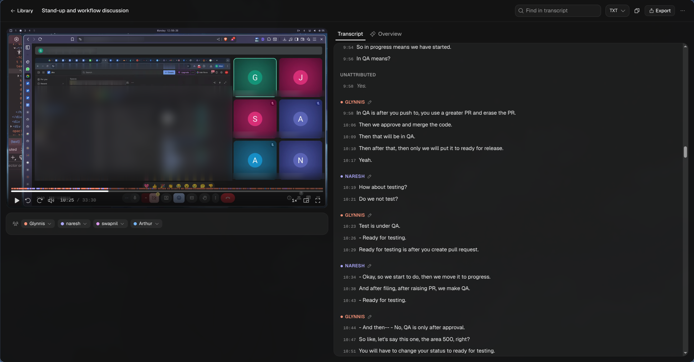
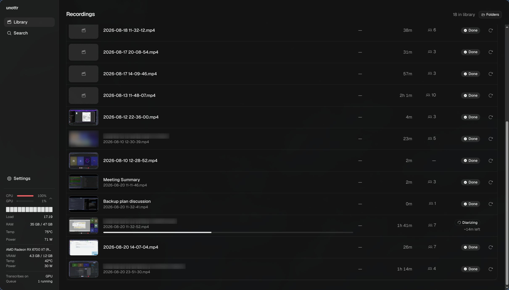
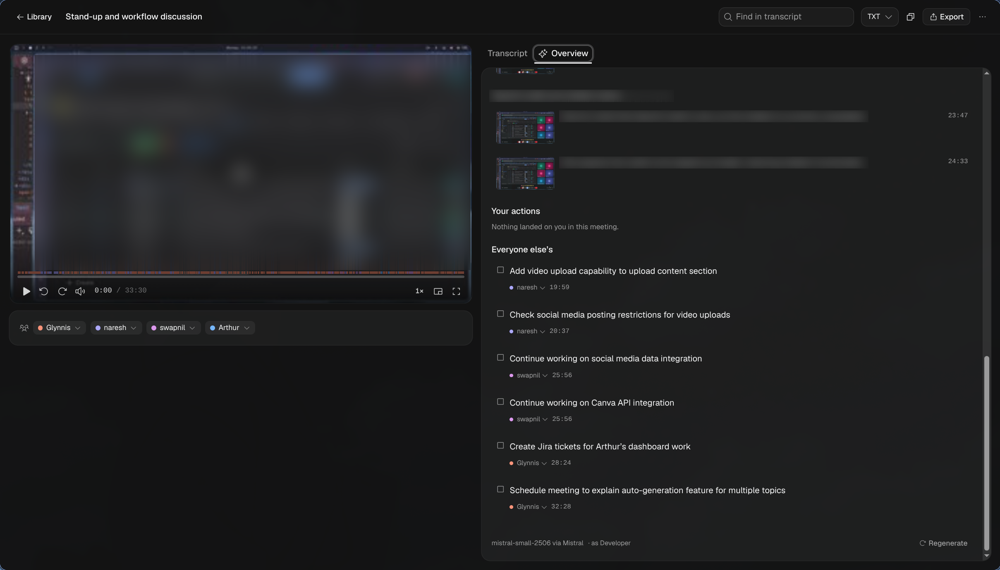
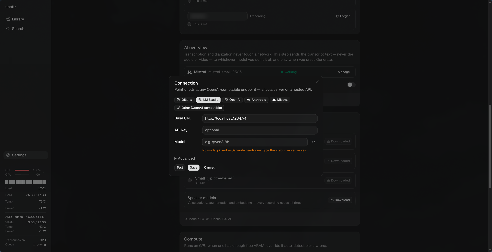
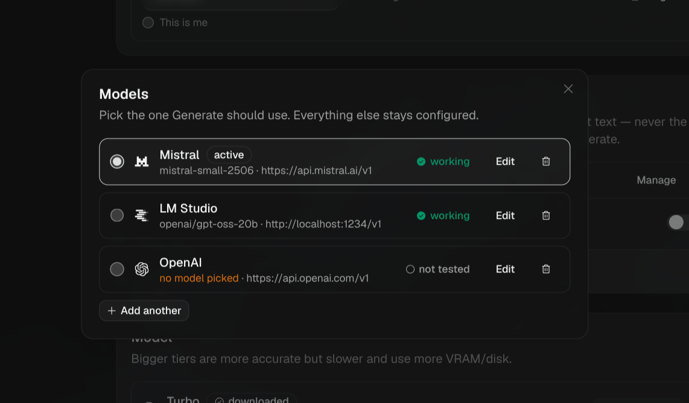

# unottr

A desktop app that watches a folder for meeting recordings and turns them into a
searchable, speaker-labelled transcript with the video playable beside it. Point it at a
folder, walk away, come back to a transcript.

No cloud, no accounts, no sign-in. Transcription and speaker separation run entirely on
your machine. The one feature that can talk to a server is an AI overview you trigger
yourself, on a model you choose — including one running on your own laptop.



---

## What it does

### Drop a recording in a folder, get a transcript

Any new file in a watched folder is picked up, probed, transcribed and diarized on its
own — no import step, no button. The library shows what's finished, what's running and how
long it has left; a row's thumbnail scrubs on hover, and clicking a frame opens the
transcript at that moment.



### Speakers that stay themselves across meetings

Speech is separated by voice (sherpa-onnx), clustered over the whole recording rather than
chunk by chunk. Name a speaker once and later recordings recognise them by voiceprint.
When the split is wrong you fix it in place: merge two speakers, reassign a single
segment, or re-run diarization with a speaker count you specify.

### Search everything, land on the second it happened

Full-text search across every transcript (SQLite FTS5). A hit opens the recording at that
timestamp; a hit inside an AI overview opens the overview tab.


### An AI overview, if and when you want one

Optional, per recording, on a model you point it at: a title, a TL;DR, topic sections, the
decisions, and a task list split into yours and everyone else's — every line clickable
back to the second it came from.

Two things make it worth having rather than another summary box:

- **The model cannot invent a timestamp.** It's handed segments as `[id] Name: text` and
  told to cite ids. Ids resolve to milliseconds in one place, and a citation that doesn't
  resolve is dropped instead of rendered as a confident link into the wrong minute.
- **Nothing is thrown away on regenerate.** Prose is overwritten; tasks you've edited,
  checked or dismissed survive.



Bring your own model — Ollama or LM Studio on this machine, or OpenAI, Anthropic, Mistral,
OpenRouter, or anything speaking an OpenAI-compatible endpoint. Local servers are knocked
on when the add form opens, so the usual case is "the one we found, already filled in".



The test has four rungs — *reachable*, *authorized*, *responds*, *structured* — run and
shown in order. The last one is the one that predicts whether Generate will actually work:
a 3B model on a laptop happily accepts any key, answers "hi", and then fails every
structured generation.



Connections live side by side — a local server and a hosted API, each with its own key,
its own consent and its own verdict. Switching between them is one radio button.

### The rest

- Export or copy a transcript as `.txt` / `.json` / `.srt` / `.vtt`.
- Rename a recording inline, in the list or the transcript header.
- Video player with speaker bands on the scrub bar, frame previews on hover, playback
  speed, and a transcript that follows along.
- Runs in the tray, starts on login if you ask it to, and picks up where it left off after
  a crash or a restart.
- CPU/GPU meters in the sidebar, so you can see what a job is costing you.

---

## Privacy

There is no network call in the transcription or diarization path. Recordings are watched,
transcribed, diarized, searched and exported entirely on this machine. The only things the
app fetches on its own are model weights on first use (once, then cached).

The AI overview is the single exception, and it is opt-in twice over: nothing happens until
you add a connection, and then nothing happens until you press **Generate** on a recording.
Consent is stored per connection and asked once each — agreeing to send a transcript to a
server on your own laptop is not agreeing to send it to somebody's cloud. Before the first
call, it shows you the exact text it is about to send.


What goes out is transcript text and speaker names — never audio, never video, never
frames. A pseudonymize toggle replaces names with "Speaker A" first. Point it at Ollama or
LM Studio and nothing leaves the machine at all. API keys are stored via the OS keyring
(`safeStorage`); if the platform has none, the app says so and asks before falling back to
plaintext.

---

## How it works

```
+--- renderer (Chromium) ---+       +--- main process (node) ----+
|  React + Vite UI          | <---> |  ipc handlers, events      |
|  <video> on unottr://     |  ipc  |  watcher, job queue        |
+---------------------------+       |  SQLite (better-sqlite3)   |
                                    +----------------------------+
                                       |                  | fork
                                    ffmpeg        +--- utilityProcess ---+
                                  (subprocess)    | transcribe, diarize, |
                                                  | merge — per job      |
                                                  +----------------------+
                                                     |              |
                                               whisper.cpp     sherpa-onnx
                                             (napi, Vulkan)  (segment + embed)
```

Every pipeline stage is a persisted queue state, so a crash resumes at a boundary rather
than starting over: **discover** (the writer has stopped and `ffprobe` reports a duration)
→ **probe** → **extract** to 16 kHz mono PCM → **transcribe** in ~30 s VAD-aligned chunks,
each written to the DB as it lands → **diarize** over the whole file → **merge** turns onto
segments → **finalize** and index. Compute runs in a forked `utilityProcess`, so a native
crash kills one job and not the app.

`DESIGN.md` has the reasoning, the diarization algorithm, and the decision log.

### Measured performance

5 minutes of a real recording. RX 6700 XT (RADV) vs 12 CPU threads:

| Model | GPU | CPU |
|---|---|---|
| `base.en` | 115× realtime | 6.7× |
| `large-v3-turbo-q5_0` | 39× realtime | **0.8×** |

`large-v3-turbo` is slower than realtime on CPU, so the default model follows the resolved
device: turbo on GPU, `small` on CPU. Diarization is CPU-only (sherpa has no GPU path) at
~4.7× realtime. A 33-minute meeting transcribes in ~83 s on a GPU. The honest summary: CPU
works, but have a GPU.

---

## What it needs

- **Linux x64 or an Apple Silicon Mac** running macOS 13 or newer. Known testers can build
  an unsigned, CPU-only Windows x64 preview. Intel Macs are not supported.
- **ffmpeg / ffprobe** are bundled in packaged builds. A development run finds them in
  `resources/bin/` or on `PATH`.
- **Vulkan on Linux or Metal on Apple Silicon** runs Whisper on the GPU. Linux can fall
  back to CPU.
- **First run** downloads the selected Whisper model and the local speaker models. Apple
  Silicon defaults to Large V3 Turbo and also downloads Small for offline recovery.
- **A model for AI overviews, only if you want them** — a local server (Ollama, LM Studio)
  or an API key. Without either, nothing else in the app is affected.

The first run walks you through it: pick a folder, download a model, optionally backfill
what's already there.


---

## Developing

```sh
pnpm install
pnpm dev                      # electron-vite: main, preload and renderer, all hot-reloaded
pnpm typecheck                # two projects: node (main/preload/worker/test) and web
pnpm test                     # vitest; the *.integration.test.ts files need real models
pnpm seed                     # a library of fake recordings to click around in
```

Native code is all prebuilt npm packages (whisper, sherpa-onnx, better-sqlite3), so there's
no compiler step and no rebuild-for-electron — every one of them is N-API.

## Packaging

```sh
scripts/fetch-ffmpeg.sh         # LGPL ffmpeg/ffprobe -> resources/bin (~220 MB, not in git)
scripts/fetch-vulkan-loader.sh  # libvulkan.so.1 -> resources/lib (the loader only, never an ICD)
pnpm dist                       # electron-vite build + electron-builder -> release/*.AppImage
```

Both fetch scripts are required. Without ffmpeg every job parks on a typed error; without
the Vulkan loader the whisper addon won't load at all on a machine with no driver installed
— it does not degrade to CPU on its own (see *Vulkan packaging* in `DESIGN.md`).

### Build on Apple Silicon

Use an M1 or newer Mac running macOS 13 or newer. Install Xcode Command Line Tools, Node,
and the pnpm version declared in `package.json`, then run:

```sh
xcode-select --install
pnpm install --frozen-lockfile
pnpm stage:macos:icon
pnpm stage:macos:ffmpeg
pnpm typecheck
pnpm test
pnpm smoke:native
pnpm dist --mac --arm64
```

The app and tester zip land under `release/`. The build is ad-hoc signed and not notarized,
so open it once with Control-click, then **Open**. See the
[full Mac build and tester checklist](docs/macos-tester-build.md) before sharing the zip.

## Docs

| File | What's in it |
|---|---|
| `DESIGN.md` | Architecture, the decision log, diarization internals, measured performance |
| `docs/plan/` | Phase-by-phase implementation plans |
| `docs/macos-tester-build.md` | Apple Silicon build and tester checklist |
| `MANUAL-CHECKS.md` | The checks that need a live app rather than a test suite |
| `THIRD-PARTY.md` | What's bundled and under which licence |
| `plans.md` | What's next |

## Licence

MIT — see [`LICENSE`](LICENSE). Bundled third-party components carry their own licences —
see [`THIRD-PARTY.md`](THIRD-PARTY.md); ffmpeg in particular is deliberately an LGPL build,
not GPL.
